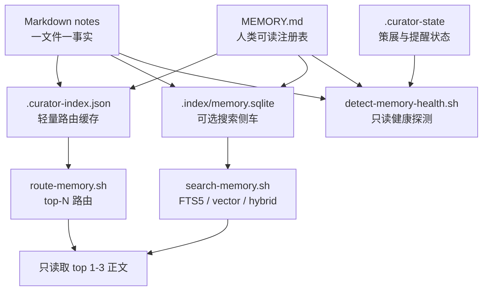
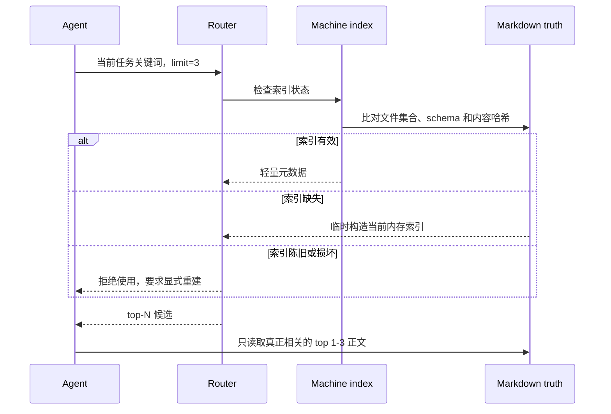
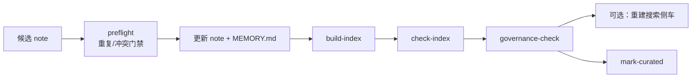

# Memory 缓存与检索架构

本文说明 `memory-curator` 当前的记忆存储、派生缓存、检索和一致性机制。
它描述的是已经实现的行为，不把实验性 POC 或后续设想写成当前能力。

## 设计目标

这套架构要同时解决三个问题：

1. **可信**：过期缓存、孤儿文件和失效链接不能悄悄参与后续判断。
2. **节省上下文**：普通任务只读取最相关的少量记忆，不把整个记忆库放进模型上下文。
3. **可恢复**：所有机器索引都能由 Markdown 重建，索引损坏不会损失原始记忆。

因此，当前实现不是通用意义上的 TTL、LRU 或自动写穿缓存，而是：

> Markdown 真相源 + 内容哈希失效 + 显式重建的派生索引。

## 总体结构



数据分为四层：

| 层 | 默认位置 | 职责 | 是否真相源 | 是否可删除重建 |
|---|---|---|---|---|
| 记忆正文 | `<memory_dir>/*.md` | 保存事实、经验、规则及治理元数据 | 是 | 否 |
| 人类注册表 | `<memory_dir>/MEMORY.md` | 一行一条记忆，供人和 Agent 快速浏览 | 是 | 需要从正文显式重建并复核 |
| 机器索引 | `<memory_dir>/.curator-index.json` | 低 token 路由、结构一致性校验 | 否 | 是 |
| 搜索侧车 | `<memory_dir>/.index/memory.sqlite` | FTS5、向量和混合召回 | 否 | 是 |
| 运行状态 | `<memory_dir>/.curator-state` | 上次策展、Git 基线和提醒冷却 | 否 | 是，但会丢失提醒基线 |

## 真相源

每条记忆保存为一个 Markdown 文件；`MEMORY.md` 保存这些文件的人类可读指针。
任何检索数据库、向量或 JSON 索引都不能反向成为记忆事实的权威来源。

对于 indexed store，稳定状态必须满足：

```text
note 文件集合
    == MEMORY.md 指向的文件集合
    == .curator-index.json 记录的文件集合
```

同时还要满足：

- 没有重复注册项；
- 没有 `MEMORY.md` 指向不存在文件的死链；
- 没有未进入 `MEMORY.md` 的孤儿 note；
- `MEMORY.md` 和每个 note 的内容哈希与机器索引一致；
- 机器索引 schema 是当前版本；
- 生命周期、时效和证据元数据通过治理门禁。

没有 `MEMORY.md` 的目录只能作为 indexless store 做文件级检查，不能声称已经达到三方一致。

## 一级派生缓存：`.curator-index.json`

### 缓存内容

机器索引从 Markdown 即时解析，主要记录：

- 标识：`file`、`name`、`type`；
- 路由：`scope`、`entities`、`summary`、`domain`、`layer`；
- 生命周期：`status`、`freshness`、`stability`、`review_after`；
- 风险与证据：`risk`、`evidence_refs`、supersession 和 wiki links；
- 一致性：note 的 `content_hash` 与 `MEMORY.md` 的 source hash。

构建时先写临时文件，再通过原子替换发布，避免读取到半写入的 JSON。

### 路由算法

`route-memory.sh` 对查询和索引字段做中英文关键词提取，然后按固定权重计算：

| 字段 | 单个命中权重 |
|---|---:|
| `scope` | 5 |
| `entities` | 4 |
| `type` | 3 |
| `name` | 2 |
| `summary` | 1 |

默认还会：

- 排除 `stale`、`superseded`、`archived`；
- 排除已经超过 `review_after` 的 active 记忆；
- 对 time-sensitive 记忆轻微降权；
- 对已产生正向匹配的 `high-if-wrong` 记忆加权，提醒调用方优先精读和核验；
- 按得分和文件名稳定排序，只返回 top-N 元数据。

路由结果不是最终事实。调用方仍需只读取排名靠前且确实相关的 note 正文；
命中高风险或非 active 记忆时，应先验证再使用。

### 缓存存在状态的语义

| 状态 | 默认行为 |
|---|---|
| `.curator-index.json` 不存在 | 从当前 Markdown 构造一次内存索引，不自动落盘 |
| 缓存存在且通过 strict check | 使用持久化机器索引路由 |
| 缓存存在但损坏或陈旧 | 拒绝路由，要求显式重建 |
| 使用 `route-memory.sh --rebuild` | 本次直接从当前源构造内存索引，不覆盖持久化缓存 |
| 使用 `build-index.sh` | 原子重建并持久化 `.curator-index.json` |

这里刻意区分“本次读取当前源”和“更新持久化缓存”。检查命令只报告问题，
不会静默改写现场证据。

## 二级派生缓存：SQLite 搜索侧车

搜索侧车默认位于 `.index/memory.sqlite`，由 `build-search-index.sh` 显式构建。
它是不可变的派生快照，查询时以 SQLite `mode=ro&immutable=1` 打开，避免召回阶段生成
WAL/SHM 文件或意外修改索引。

### 关键词召回

所有 note 的正文和路由字段会进入 FTS5。keyword 策略使用 FTS5/BM25 召回，
并继续应用 status、`review_after`、layer、freshness 和 risk 过滤。

### 向量召回

当前支持三种构建 provider：

| provider | 用途 | 说明 |
|---|---|---|
| `none` | 仅关键词索引 | 不生成向量 |
| `local-hash` | 零网络、确定性的回归基线 | 不是语义 embedding |
| `command` | 接入受信任的真实 embedding adapter | 校验 provider/model/fingerprint/dimensions |

真实 embedding 默认只发送 summary 级字段，并只向量化 active、未过期记忆；
只有显式选择 `full` 或 `--embedding-include-inactive` 才扩大数据范围。
远程 adapter 可能接收记忆内容，因此必须先取得数据外发授权。

`memory-curator` 不读取、输出或持久化 API Key，也不把 adapter 命令写入数据库。

### 混合召回和降级

hybrid 策略使用 Reciprocal Rank Fusion 合并 keyword 与 vector 排名。
如果没有可用向量，vector/hybrid 会在结果中明确记录降级为 keyword；
这类结果不能作为“语义检索有效”的 benchmark 成绩。

provider、model、fingerprint、dimensions 不一致或 adapter 执行失败时硬失败，
不会自动切换到 `local-hash` 后继续冒充语义检索。

### 侧车失效

SQLite manifest 保存语料 `corpus_hash`。该哈希由以下内容生成：

- `MEMORY.md` source hash；
- 每个 note 的文件名和 `content_hash`。

每次搜索前都会基于当前 Markdown 重新计算 corpus hash。只要注册表或任一 note 发生变化，
搜索就拒绝陈旧侧车并要求显式重建。

## `.curator-state` 不是内容缓存

`.curator-state` 是简单的 `key=value` 状态文件，目前保存：

- `last_curation_epoch`：上次完整策展通过的时间；
- `last_curation_sha`：当时的 Git HEAD；
- `last_notify_epoch`：最近一次健康提醒时间，用于冷却节流。

它不参与记忆事实或召回排序。健康探测器使用这些基线判断距离上次策展的天数、
提交数和提醒冷却时间。只有 strict consistency gate 通过后才能运行 `mark-curated.sh`。

## 读取时序

普通任务的推荐路径：



规模策略：

- 小库：`<=10` 条且 `<=20KB`，可以直读少量明确相关的 note；
- 中库：`11-30` 条或 `20-50KB`，先确保机器索引通过检查，再 route top 1-3；
- 大库：`>30` 条或 `>50KB`，先 build/check，再按索引字段分层缩小到 top 1-3。

SQLite 搜索侧车是增强召回路径，不是普通路由的强制依赖。

## 写入与重建时序

当前实现不是 write-through cache。写入真相源后，派生缓存会自然失效，必须显式重建：



`preflight-memory.sh` 会检测：

- 内容哈希完全相同的重复 note；
- 高相似候选；
- 高相似且规则方向相反的潜在冲突。

阻断项需要人工读正文确认后才能显式 acknowledge。它减少重复和矛盾写入，
但不替代后续三方一致性与治理检查。

推荐命令顺序：

```bash
./scripts/preflight-memory.sh --memory-dir <memory_dir> --candidate <candidate.md>
# 人工确认后更新 note 与 MEMORY.md
./scripts/build-index.sh --memory-dir <memory_dir>
./scripts/check-index.sh --memory-dir <memory_dir>
./scripts/governance-check.sh --memory-dir <memory_dir>
# 仅在需要 FTS5/向量召回时重建
./scripts/build-search-index.sh --memory-dir <memory_dir> --provider local-hash
CURATOR_MEMORY_DIR=<memory_dir> ./scripts/mark-curated.sh
```

## 失效与恢复矩阵

| 变化或故障 | 机器索引 | 搜索侧车 | 恢复动作 |
|---|---|---|---|
| note 正文或 frontmatter 修改 | 失效 | 失效 | 必要时同步注册表摘要，再重建两类派生索引 |
| note 新增或删除 | 失效，且可能出现孤儿/死链 | 失效 | 成对更新文件与 `MEMORY.md`，再重建 |
| 仅修改 `MEMORY.md` | 失效 | 失效 | 确认注册表正确后重建 |
| JSON 损坏或 schema 过旧 | 不可用 | 不一定受影响 | 由 Markdown 显式重建 JSON |
| SQLite 损坏或 corpus hash 不一致 | 不受影响 | 不可用 | 删除或覆盖重建 SQLite |
| embedding provider 身份变化 | 不受影响 | 语义查询硬失败 | 用目标 provider 重建侧车 |
| `.curator-state` 丢失 | 不受影响 | 不受影响 | 通过完整门禁后重新 `mark-curated` |

## 关键保证与边界

### 当前保证

- Markdown 永远是可审阅、可版本控制的真相源；
- 陈旧持久化缓存不会被静默使用；
- 构建使用临时文件和原子替换，避免半成品索引；
- 普通路由默认不读取整个记忆库正文；
- 远程 embedding 不自动启用，也不持久化密钥；
- 缺少向量时的降级是显式、可观测的；
- 探测器和兼容 hooks 只提醒，不自动删除或修改记忆。

### 当前边界

- 没有后台常驻进程、自动刷新或文件监听；
- 没有 TTL、LRU 或容量驱逐策略；`review_after` 是记忆治理日期，不是缓存 TTL；
- 普通 route 使用确定性字段匹配，不等同于语义检索；
- `local-hash` 只适合可复现回归，不代表真实语义质量；
- 搜索侧车是完整快照，每次变更后显式整体重建，而不是增量更新；
- 检索只负责找候选，不能替代对高风险、过期或冲突记忆的事实核验。

这些边界是当前“简单、确定、可审计”设计的结果。只有 benchmark 或实际规模证明
整体重建、确定性路由成为瓶颈时，才应考虑文件监听、增量索引或更复杂的缓存策略。

## 代码入口

| 入口 | 作用 |
|---|---|
| `scripts/memory_index.py` | Markdown 解析、JSON build/check/route、preflight |
| `scripts/memory_search.py` | SQLite FTS5、向量、RRF、corpus hash 校验 |
| `scripts/build-index.sh` | 持久化机器索引 |
| `scripts/route-memory.sh` | 低 token 路由 |
| `scripts/build-search-index.sh` | 构建搜索侧车 |
| `scripts/search-memory.sh` | 查询搜索侧车 |
| `scripts/governance-check.sh` | 生命周期、时效和证据门禁 |
| `hooks/detect-memory-health.sh` | 确定性健康信号检测 |
| `scripts/mark-curated.sh` | consistency gate 通过后记录策展基线 |
